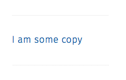
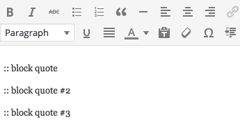
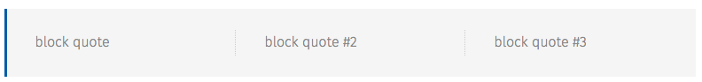

.. This Source Code Form is subject to the terms of the Mozilla Public
.. License, v. 2.0. If a copy of the MPL was not distributed with this
.. file, You can obtain one at http://mozilla.org/MPL/2.0/.


==========
Articles
==========

Articles should be easey-peasey to edit in wordpress. Below are the items specific to our theme.

------------


Full & Short Titles
-------------------

There are 2 titles for each article, the full title (used on the article page) and the short title
used everywhere else. If a short title is not supplied the long title will be used.

------------

Deck
----

The ``exerpt`` field is used for the deck and is required.

------------

Categories
----------

Articles should be assigned a single category from the 6 main categories. Other modifier categories
such as "sponsored" can also be added.

------------

Content
-------

The following codes allow you to manipulate the contents of the articles.

Shortcodes
~~~~~~~~~~~

``[post_gallery id="ID HERE"]`` will insert a gallery in the post.

Blockquotes
~~~~~~~~~~~

Blockquote tags will be pulled to the side and have a share button added to them.

``<blockquote>I am some copy</blockquote>`` is Rendered As:



They will maintain their vertical position within the flow of the document, and the content below them will collapse to fill in the space they occupied.

.. note::  {fill in number of blockquotes allowed and if their position in the copy matters}.


Block Grids
~~~~~~~~~~~
Block grids can be created by putting ```::``` at the beginning of a P tag.
All consequtive p tags that start with ```::``` will be put into the same block grid.

Example:



Rendered As:



------------

Hero Images & Thumbnails
------------------------
Each article "usually" has a hero image. To set this image for an article add it as the
``featured image``. Note this image is used as the thumbnail, insterted into the rss feed and in
other places.

Since the various image sizes are generated upon upload, you should upload a large and high quality
(Max Size 25mb).

Featured Articles
------------------------
Articles that have their visibility set to "Promoted to front page" will go into the row below the hero on the home page
The newest article that have the Category "Lead" will be the primary post on the home page

Still need to add
--------------------------------------------
- What All The Custom Fields Are For
- Featured articles, etc
- categories
- tags
- homepage stuff

