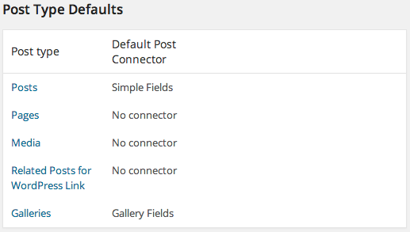

.. This Source Code Form is subject to the terms of the Mozilla Public
.. License, v. 2.0. If a copy of the MPL was not distributed with this
.. file, You can obtain one at http://mozilla.org/MPL/2.0/.

=============
Simple Fields
=============

This plugin provides simple custom fields to the editing interface. For example
"sponsored" and "short title".

- Enable plugin
    #. Go to settings->Simple Fields
    #. Import simple-fields-export.json from themes->theopenstandard->imports
    #. Set "Default Post Connector" for Posts to "Simple Fields" - as follows:

